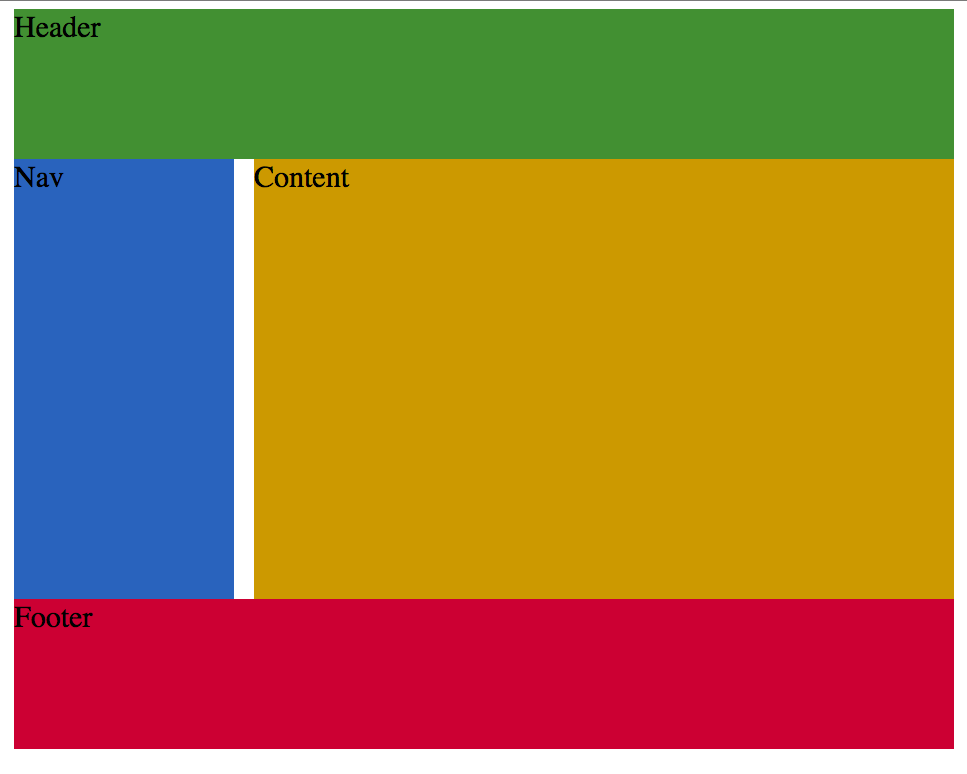

CSS
===

CSS asocia reglas de estilo con elementos HTML

Sintaxis
--------

.. code-block:: css
   :linenos:

   p {
     font-family: Arial;
   }

.. code-block:: css
   :linenos:

   h2, h3 {
     font-size: 30px;
     color: green;
   }

Para incluir un archivo css usamos el elemento *link*

.. code-block:: html
   :linenos:

    <!doctype html>
    <html lang="en">
        <head>
            <meta charset="utf-8">
            <title>Ejemplo CSS</title>
            <link rel="stylesheet" href="css/main.css">
        </head>

Selectores
----------

Selector universal

.. code-block:: css
   :linenos:

   * {}

Selector por tipo

.. code-block:: css
   :linenos:

   h2, h3 {}

Selector de clase

.. code-block:: css
   :linenos:

   .jumbotron {}
   div.navbar-header {}

Selector de id

.. code-block:: css
   :linenos:

   #navbar {}

Selecctor de hijos

.. code-block:: css
   :linenos:

   li>a  {}

Selector de desendientes

.. code-block:: css
   :linenos:

   p a  {}

Formato visual
--------------

*CSS* supone que cada elemento genera una o más cajas rectangulares
(*element boxes*)

 .. raw:: html

    <ul>
        <li> margin </li>
        <li> border </li>
        <li> padding </li>
    </ul>
    

        

            

                

                    content area
                

            

        

    

Propiedades del margen
~~~~~~~~~~~~~~~~~~~~~~

 * margin
 * margin-top
 * margin-bottom
 * margin-right
 * margin-left

El margen siempre es tranparente, permitiendo que el fondo del elemento padre sea visible.

Propiedades del borde
~~~~~~~~~~~~~~~~~~~~~

 * border-style (dotted, dashed, solid, double)
 * border-top-style
 * border-right-style
 * border-bottom-style
 * border-left-style
 * border-width
 * border-color
 * border (border-width border-style border-color)

Propiedades del padding
~~~~~~~~~~~~~~~~~~~~~~~

  * padding
  * padding-top
  * padding-right
  * padding-bottom
  * padding-left

El fondo del contenido se aplica al padding.

Dislplay
~~~~~~~~

La propiedad *display* especifica si/como se muestra un elemento.
Los posibles valoress son:

  * none
  * inline
  * block

.. literalinclude:: src/display.html
    :linenos:
    :language: html
    :lines: 18-24

¿Que reglas aplicacmos si queremos que la lista se despliegue de la siguiente manera?

 | Contacto | Mapa del sitio | Directorio | Correo | Ingresar |

..  admonition:: CSS
    :class: toggle

    .. literalinclude:: src/display.html
        :linenos:
        :language: css
        :lines: 7-14

Ejemplo
-------

.. literalinclude:: src/01-css.html
    :linenos:
    :language: html

.. literalinclude:: src/01-css.html
    :linenos:
    :language: html
    :lines: 9-19

..  admonition:: CSS <header>
    :class: toggle

    .. literalinclude:: src/css/main02.css
        :linenos:
        :language: css
        :lines: 1-30

.. literalinclude:: src/01-css.html
    :linenos:
    :language: html
    :lines: 21-28

..  admonition:: CSS <nav>
    :class: toggle

    .. literalinclude:: src/css/main02.css
        :linenos:
        :language: css
        :lines: 32-66

.. literalinclude:: src/01-css.html
    :linenos:
    :language: html
    :lines: 30-47

..  admonition:: CSS <main> <article> <section>
    :class: toggle

    .. literalinclude:: src/css/main02.css
        :linenos:
        :language: css
        :lines: 68-103

..  admonition:: CSS <aside>
    :class: toggle

    .. literalinclude:: src/css/main02.css
        :linenos:
        :language: css
        :lines: 105-122

Media Queries
-------------

Los *media queries* nos permiten preguntarle al navegador si ciertas expresiones son verdaderas.
Si se cumplen podemos aplicar un bloque de estilos y modificar la manera de desplegar los elementos.

La forma general de un *media query* es:

.. code-block:: css

    @media [not|only] type [and] (expr) {
        rules
    }

* Media types: especifican el tipo de dispositivo en que será aplicado (all, screen, print)
* Media expressions: evalua una propiedad y regresa Falso o Verdadero
* Logical keywords: operadores logicos (and, or, not, only) que permiten crear expresiones mas complejas
* Rules: estilos basicos que ajustan los elementos

Ejemplo 1 (Media Type)
~~~~~~~~~~~~~~~~~~~~~~

.. literalinclude:: src/grid.html
    :linenos:
    :language: html

..  admonition:: CSS print
    :class: toggle

    .. literalinclude:: src/css/grid-print.css
        :linenos:
        :language: css
        :lines: 6-16

Un ejemplo de una *media expression" seria determinar si el ancho es mayor a 320px

.. code-block:: css

    @media screen and (min-width: 320px) {
    }

Ejemplo 2 (media expression)
~~~~~~~~~~~~~~~~~~~~~~~~~~~~

.. literalinclude:: src/responsive.html
    :linenos:
    :language: html

..  admonition:: mobil-first.css
    :class: toggle

    .. literalinclude:: src/css/mobil-first.css
        :linenos:
        :language: css

..  admonition:: desktop-first
    :class: toggle

    .. literalinclude:: src/css/desktop-first.css
        :linenos:
        :language: css

Viewports
~~~~~~~~~

.. code-block:: css

    <meta name=”viewport” content=”width=device-width” />

.. code-block:: css

    @viewport {
      width: device-width;
    }

Ejemplo 3
~~~~~~~~~

.. literalinclude:: src/grid.html
    :linenos:
    :language: html

:download:`grid-px.css <src/css/grid-px-sol.css>`

Referencias
-----------

`Responsive Web Design <http://alistapart.com/article/responsive-web-design>`_
