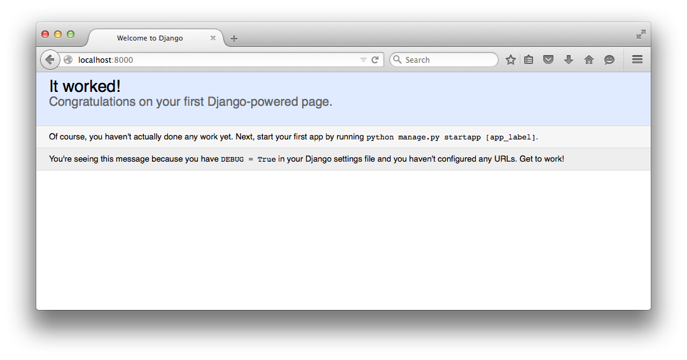

Django
======

`Django <https://www.djangoproject.com/>`_ es un Web Framework para
`Python <https://www.python.org/>`_.

Instalación
-----------

Se recomienda usar un ambiente virtual

.. code-block:: bash

    $ virtualenv-2.7 pycon2020_project
    $ cd pycon2020_project/
    $ source bin/activate

para instalar django usamos pip

.. code-block:: bash

    $ pip install django
    Downloading/unpacking django
    Downloading Django-1.8.4-py2.py3-none-any.whl (6.2MB): 6.2MB downloaded
    Installing collected packages: django
    Successfully installed django
    Cleaning up...

Iniciando un proyecto
---------------------

.. code-block:: bash

    $ django-admin startproject pycon2020_site
    $ cd pycon2020_site

.. code-block:: bash

    pycon2020_site
    |-- pycon2020_site
    |   |-- __init__.py
    |   |-- settings.py
    |   |-- urls.py
    |   |-- wsgi.py
    `-- manage.py

manage.py
~~~~~~~~~

.. code-block:: bash

    $ python manage.py runserver 0.0.0.0:8000
    Performing system checks...

    System check identified no issues (0 silenced).

    You have unapplied migrations; your app may not work properly until they are applied.
    Run 'python manage.py migrate' to apply them.

    September 28, 2015 - 01:19:18
    Django version 1.8.4, using settings 'pycon2020_site.settings'
    Starting development server at http://0.0.0.0:8000/
    Quit the server with CONTROL-C.

En el navegador ir a `<http://localhost:8000>`_

Bases de Datos
~~~~~~~~~~~~~~

Una migración sirve para mover la base de datos de un diseño a otro.

.. code-block:: bash

    $ python manage.py migrate
    Operations to perform:
      Synchronize unmigrated apps: staticfiles, messages
      Apply all migrations: admin, contenttypes, auth, sessions
    Synchronizing apps without migrations:
      Creating tables...
      ...

Django usa por default como base de datos `sqlite <https://www.sqlite.org>`_

La configuración se encuentra en pycon2020_site/pycon2020_site/settings.py

.. code-block:: bash

    pycon2020_site
    |-- db.sqlite3
    |-- pycon2020_site
    |   |-- __init__.py
    |   |-- settings.py
    |   |-- urls.py
    |   |-- wsgi.py
    `-- manage.py

Views y URLs
------------

Crea el archivo pycon2020_site/pycon2020_site/views.py y agregamos una vista

.. literalinclude:: src/pycon2020_site/pycon2020_site/views.py
    :linenos:
    :language: python

Creamos una URL que respondera con la vista anterior

.. literalinclude:: src/pycon2020_site/pycon2020_site/urls.py
    :language: python
    :lines: 18-20, 22-23

En el navegador ir a `<http://localhost:8000>`_

Apps
----
En Django un proyecto representa un sitioweb completo.

* configuración global
* inclusion de funcionalidad adicional
* lista principal de URLs

Una **app** de Django encapsula una unidad de duncionalidad

* Una sección de Blog
* Un Foro de discusión
* Un sistema de etiquetas

Creamos una app que incluiremos en el proyecto.

.. code-block:: bash

    $ python manage.py startapp talks

.. code-block:: bash

    talks
    |-- migrations
    |   |-- __init__.py
    |-- __init__.py
    |-- admin.py
    |-- models.py
    |-- tests.py
    `-- views.py

Para extender el proyecto con la **app** modificamos el archivo pycon2020_site/pycon2020_site/settings.py

.. literalinclude:: src/pycon2020_site/pycon2020_site/settings.py
    :language: python
    :lines: 33-40, 90-92

Models
------

ORM (Object Relational Mapper)

Los Modelos son Clases que represntan tablas en una base de datos.
Cada modelo es una tabla y cada atributo de la clase es una columna en la tabla.

.. literalinclude:: src/pycon2020_site/talks/models.py
    :language: python
    :lines: 1-9

Tenemos un nuevo modelo, necesitamos una migración.

.. code-block:: bash

    $ python manage.py makemigrations talks

Realizamos la migración

.. code-block:: bash

    $ python manage.py migrate talks
    Operations to perform:
      Apply all migrations: talks
    Running migrations:
      Rendering model states... DONE
      Applying talks.0001_initial... OK

Interacción con Django
~~~~~~~~~~~~~~~~~~~~~~

.. code-block:: bash

    $ python manage.py shell
    Python 2.7.8 (default, Nov 24 2014, 11:29:53)
    [GCC 4.2.1 Compatible Apple LLVM 6.0 (clang-600.0.54)] on darwin
    Type "help", "copyright", "credits" or "license" for more information.
    (InteractiveConsole)
    >>>

Cuando queremos hacer una consulta con el ORM necesitamos el nombre del modelo y su atributo objects. objects apunta al 'model manager' que controla el acceso a las instancias del modelo y otras cosas.

.. code-block:: bash

    >>> from talks.models import Talk
    >>> Talk.objects.all()
    []
    >>> type(Talk.objects.all())
    <class 'django.db.models.query.QuerySet'>
    >>>

.. code-block:: bash

    >>> t = Talk()
    >>> t.title = "Python"
    >>> t.description = "Introduccion"
    >>> t.save()
    >>> Talk.objects.all()
    [<Talk: Talk object>]
    >>>

.. code-block:: bash

    >>> from talks.models import Talk
    >>> Talk(title='Estructuras de Datos con python', description='Aprende sobre listas, diccionario y tuplas').save()
    >>> Talk.objects.all()
    [<Talk: Talk object>, <Talk: Talk object>]
    >>>

.. code-block:: bash

    >>> Talk.objects.create(title='Orientacion a Objectos en Python', description="Revisaremos las clases en python")
    <Talk: Talk object>
    >>> Talk.objects.all()
    [<Talk: Talk object>, <Talk: Talk object>, <Talk: Talk object>]
    >>>

modificamos talks/models.py

.. literalinclude:: src/pycon2020_site/talks/models.py
    :language: python
    :lines: 11-12

.. code-block:: bash

    >>> from talks.models import Talk
    >>> Talk.objects.all()
    [<Talk: Python>, <Talk: Estructuras de Datos con python>, <Talk: Orientacion a Objectos en Python>]
    >>>
